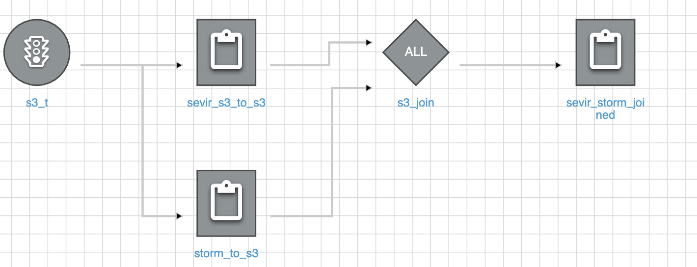

# AWS
Here, we are leveraging AWS for developing data pipeline using AWS Glue, query and visualize the data using Amazon Quicksight

## Instructions to run 
* Download the required .whl files listed below and place it in your s3 bucket
*   * s3fs-0.3.4-py3-none-any.whl
*   * h5py-3.1.0-py3.8-macosx-10.9-x86_64.egg

* Create jobs in Amazon glue for each of the python files described below 
  * Sevir_s3_to_s3: To connect to the source(sevir) S3 bucket and do 3 level filtering and then upload the data to our S3 bucket with reduced file sizes 
  * Storm_to_s3: Connects to .gz files in local S3 and then carry out the below filtering:
    Filtering the data based on date range
  . Converting the Damage property and damage crops to Numeric 
  . Once all these filterings are done it loads back the transformed data to S3

  * sevir_storm_joined.py : Performs 3 joins:
    . Sevir data with Storm details data(Many to One)
    . Storm Fatalities data with Storm Details data(Many to One)
    . Storm Locations data with Storm Details data(Many to One)
    . Once all these joins are performed it stores back to S3

  * ftp_storm.py: Extracts the file from ftp server and loads into s3

* Add these jobs to the workflow as per the below image

## Report
Refer to https://codelabs-preview.appspot.com/?file_id=1jBm19uLwkIqiLjWorO7ClJ5UcWRHkf_WgXqZcVmBPM0#0 for detailed description of the pipeline illustration

