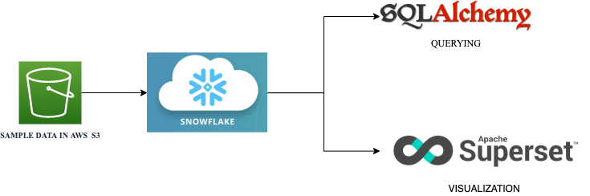
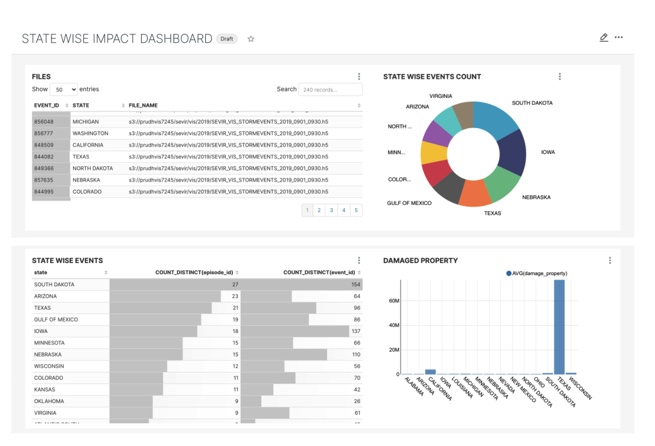
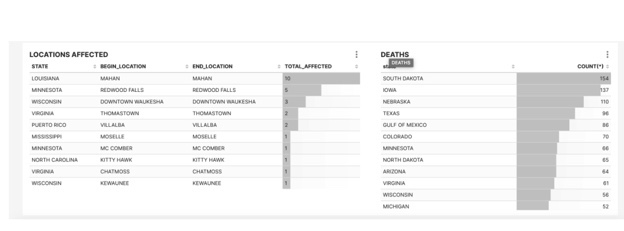

Snowflake Pipeline: 

**Getting Started** 
Download & Configure Apache Superset from [here](https://superset.apache.org/docs/installation/installing-superset-from-scratch) 
Connect to Apache Superset with connection string : 
              **snowflake://{username}:{password}@{account}/{database}/{schema}?warehouse={warehouse}&role={role}**  
*Python Libraries* 
- ConfigParser 
- sqlalchemy 
- apache-superset  

**Usage**  

Using **snowflake_scripts** 

Run this file in snowflake database to create tables/views and import data from S3   

Using **config_file.ipynb**  

Add the database connection details and run the file for setting up database connection parameters  

Using **SQLAlchemy.ipynb** 

Run this file for querying the snowflake database 

**Apache Superset Dashboard**

