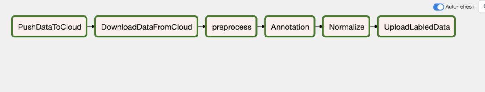

Annotation Pipeline
This pipeline aims to predict sentiments for each sentence in a list of company earnings call transcripts



***Project Structure*** :
```
Part1_AnnotationPipeline/
├── dags/ 
│   ├── config.yaml: setting up parameters for running the file 
│   ├── edgar_annotation.py : an entry module for airflow 
│   ├── files_upload.py: file that fecthes data from S3 
│   └── sec-edgar/ 
│       └── call_transcripts/: List of files that are uploaded to S3 
├── edgar_download/: Files downloaded from s3 
├── images/ 
│   ├── AnnotationPipeline.png 
│   └── README.md 
├── logs/: Logs 
├── README.md 
├── requirements.txt: Requirements file 
```

***Requirements*** -
Install the dependencies as outlines in the requirements.txt by running pip install -r requirements.txt

***Configurations***
Update the dags/config.yaml with dynamic parameters for execution of the pipeline as described below

bucket -> your s3 bucket <br/>
filepath -> local directory where your intial source files are present and are uploaded to s3 <br/>
downloadpath -> root directory path to download files <br/>
fetchpath -> local directory where your files are downloaded from s3 and stored <br/>
APIKey -> API key for accesing Microsoft Cognitive Service  <br/><br/>

***Airflow Configuration*** <br/>
- Use your present working directory as the airflow home export AIRFLOW_HOME=~(pwd) <br/>
- export Python Path to allow use of custom modules by Airflow export PYTHONPATH="${PYTHONPATH}:${AIRFLOW_HOME}" <br/>
- initialize the database airflow db init <br/>
- airflow users create \ --username admin \ --firstname <YourName> \ --lastname <YourLastName> \ --role Admin \ --email example@example.com <br/>

***Instructions to run*** <br/>
Run airflow by following these commands <br/>
- Start the airflow server in daemon on port 8081 airflow webserver -D -p 8081 <br/>
- Start the scheduler airflow scheduler Once both are running , you can access the UI by visting http://127.0.0.1:8080/home on your browser. <br/>
- Once you login to Airflow on the browser, run the DAG ***EDGAR-Annotation-Pipeline*** <br/>
- Once the pipeline is run successfully, the model is saved in the specified path in the s3 bucket. <br/>
- The command lsof -i tcp:8081  shows a list of processes with PIDs <br/>
- kill PID command can be used to kill the process <br/><br/>
***CLAT document*** - <br/>
Refer to https://codelabs-preview.appspot.com/?file_id=1jCLBg9N-M6sL1eEP3I5kE4cvZVNoPEeiTT1aiGq8qdY#0 for detailed report on the creating an annotation pipeline
