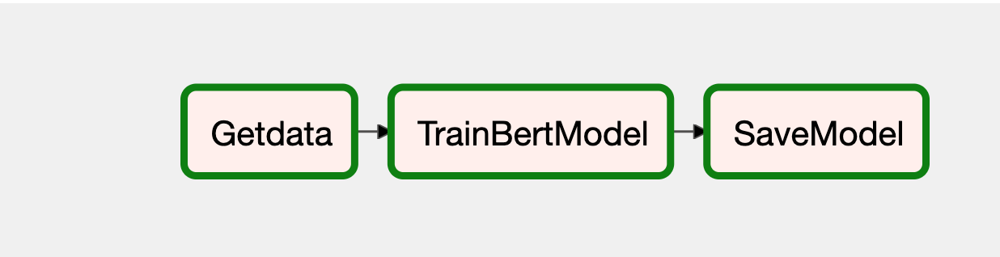

## Training Pipeline
Pipeline to fetch the data from s3 containing the labelled dataset from annotation pipeline and train/fine tune a BERT model using Transfer learning to train on our data and save the model to s3 bucket


## Github Pipeline
```
├── dags/
│   ├── config.yaml : Parameters to dynamically run the file
│   ├── train.py : entry module for airflow
│   └── utils/
│       └── utils.py: Function to load the config.yaml file
├── images/ 
│   ├── TrainingPipeline.png 
├── logs/: Log files
├── README.md
├── requirements.txt : Requirements to be installed
```
### Requirements - 
Install the dependencies as outlines in the requirements.txt by running 
`pip install -r requirements.txt`

### Configurations
Update the `dasgs/config.yaml` with dynamic parameters for execution of the pipeline as described below
- `bucket` -> your s3 bucket
- `aws_secret_access_key, aws_access_key_id `-> AWS root credentials
- `local_downloaddir` -> local directory where your intial source file needs to be downloaded
from s3
- `s3_sourcefilename` - The source file name in s3 used for training the model
- `s3_target` -> s3 target directory name where you want your model saved
- `saved_model_path`: The directory name where you want the model to be saved in your local

#### Airflow Configuration 
- Use your present working directory as the airflow home
`export AIRFLOW_HOME=~(pwd)`

- export Python Path to allow use of custom modules by Airflow
`export PYTHONPATH="${PYTHONPATH}:${AIRFLOW_HOME}"`
- initialize the database
`airflow db init`

`airflow users create \
    --username admin \
    --firstname <YourName> \
    --lastname <YourLastName> \
    --role Admin \
    --email example@example.com
`

### Instructions to run
**Run airflow by following these commands**
- Start the airflow server in daemon on port 8081 `airflow webserver -D -p 8081`
- Start the scheduler 
` airflow scheduler`
Once both are running , you can access the UI by visting http://127.0.0.1:8080/home on your browser.
- To kill the web server
    - `lsof -i tcp:8081`
    It shows a list of processes with PIDs
    - `kill <PID>` to kill the process
- Once you login to Airflow on the browser, run the DAG 'Model-Training-Pipeline'
- Once the pipeline is run successfully, the model is saved in the specified path in the s3 bucket.

#### CLAT document - 
Refer to https://codelabs-preview.appspot.com/?file_id=1jCLBg9N-M6sL1eEP3I5kE4cvZVNoPEeiTT1aiGq8qdY#0 for detailed report on the sentiment model
