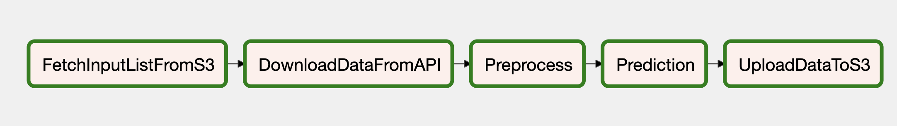

**Airflow Inference Pipeline**
This pipeline aims to give sentiments as positive or negative based on dynamic inputs.



***GitHub Pipeline***:
```
Part4-InferencePipeline/
├── airflow/
│   ├── dags/
│   │   ├── companies_list.csv : List of companies we to extract the earning call transcripts
│   │   ├── config.yaml: Configuration parameters
│   │   └── edgar_inference.py : Airflow dag file
│   ├── requirements.txt : Requirements file
├── annotation.csv : Annotated text data
├── CompaniesCallData.csv : Call transcripts extracted from 
├── fastAPI_run.sh : Run this script to activate FAST API app
├── images/
│   └── InferencePipeline.png
├── inference-data/ : Transcript file storage
│   ├── ACFN
│   ├── BLFS
│   ├── BMMJ
│   ├── CELTF
│   ├── GHLD
│   ├── IRIX
│   ├── KGFHF
│   └── TME
├── main.py : FASTAPI code file
├── README.md
└── Sentiments.csv : Text data with sentiments as positive or negative
```

Requirements -
Install the dependencies as outlines in the requirements.txt by running pip install -r requirements.txt

Configurations
Update the dags/config.yaml with dynamic parameters for execution of the pipeline as described below

 - bucket -> your s3 bucket <br/>
 - downloadpath -> root directory path to download files <br/>
 - fetchpath -> local directory where your files are downloaded from s3 and stored <br/>
 - APIKey -> API key for accesing Microsoft Cognitive Service  <br/>
 - aws_access_key_id -> AWS access key <br/>
 - aws_secret_access_key -> AWS secret key <br/>
 - FlaskUrl -> Flask URL <br/>
 - fileinput: <br/>
     - object_key: Input company name filelist <br/>
     - prefix: Input S3 storage location <br/>
 - stage: <br/>
     - object_key: Earning transcripts file name <br/>
     - prefix: Staging S3 storage location <br/>
 - final: <br/>
     - sentiment_key:Transcripts with Sentiment <br/>
     - prefix: Final S3 storage location <br/><br/>

***Airflow Configuration*** <br/>
- Use your present working directory as the airflow home export AIRFLOW_HOME=~(pwd) <br/>
- export Python Path to allow use of custom modules by Airflow export PYTHONPATH="${PYTHONPATH}:${AIRFLOW_HOME}" <br/>
- initialize the database airflow db init <br/>
- airflow users create \ --username admin \ --firstname <YourName> \ --lastname <YourLastName> \ --role Admin \ --email example@example.com <br/>

***FASTAPI Configuration*** <br/>
- Run uvicorn main:app --reload to start the FAST API server

***FLASK Configuration*** <br/>
- Follow steps mentioned [here](https://github.com/bigdatahpp/Team4_CSYE7245_Spring2021/tree/main/Assignment2/SentimentAPI-Flask-Part3) to setup Flask application on GCloud . Activate the service url

***Instructions to run*** <br/>
Run airflow by following these commands <br/>
- Start the airflow server in daemon on port 8081 airflow webserver -D -p 8081 <br/>
- Start the scheduler airflow scheduler Once both are running , you can access the UI by visting http://127.0.0.1:8080/home on your browser. <br/>
- Once you login to Airflow on the browser, run the DAG ***EDGAR-Inference-Pipeline*** <br/>
- Once the pipeline is run successfully, the model is saved in the specified path in the s3 bucket. <br/>
- The command lsof -i tcp:8081  shows a list of processes with PIDs <br/>
- kill PID command can be used to kill the process <br/><br/>
CLAT document - <br/>
Refer to https://codelabs-preview.appspot.com/?file_id=1jCLBg9N-M6sL1eEP3I5kE4cvZVNoPEeiTT1aiGq8qdY#0 for detailed report on the creating an annotation pipeline
